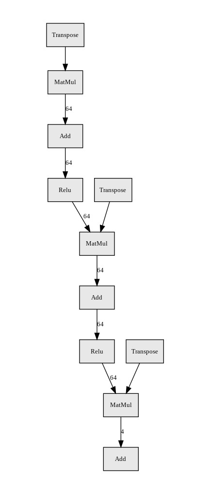

# Project 1: Navigation

<!-- The report clearly describes the learning algorithm, along with the chosen hyperparameters. It also describes the model architectures for any neural networks. -->

## Learning Algorithm: Deep Q-Netowrk (DQN)

A DQN is a way to avoid the instability and performance issues when dealing with large state or action spaces.

Two features are usually implemented to deal with them:
* __Experience replay__: decorrelate the sequence of experiences and follow the i.i.d. constraint for neural nets
* __Fixed target network__: avoid moving target by constantly using an updated Q network

It was popularized by [Mnih et al.](https://storage.googleapis.com/deepmind-media/dqn/DQNNaturePaper.pdf) in their work with Atari games.


### Experience replay
As the agent interacts with the environment, the sequence of experiences becomes highly correlated. These correlations might introduce high variance. In order to avoid this issue, we use Experience replay where $k$ experiences are stored in memory and sampled from a uniform distribution.

Experience replay uses a replay buffer which contains a collection of experiences defined by $(S, A, R, S')$ with $S$ being the current state, $A$ the action taken, $R$ the reward we get in that state and $S'$ the next state.

We sample a small batch of experiences from the replay buffer to learn (i.e. update the Q value). Experience replay improves data efficiency, removes correlations in the observation sequences, and smooths over changes in the data distribution.

#### Advantages
  * More efficient use of previous experiences, as one sample can be used multiple times
  * Better convergence as the data used respect the i.i.d constraint (break the temporal correlations in the data)
#### Disadvantages
  * Good and bad experiences (quality-wise) are treated the same
    * This is solved by the Prioritized experience replay (prioritize the transitions that have a high TD error, i.e large difference between estimated Q value and actual Q value)


### Fixed Q-Targets
It uses two networks with the same architecture but:
* One is updated once in a while (the fixed target network)
* One is updated at each step of the learning

In the following equation:
$$Q(S_t, A_t)  \leftarrow Q(S_t, A_t) + \alpha (R_{t+1} + \gamma \text{max}_{a \in A} Q(S_{t+1}, a) - Q(S_t, A_t))$$

The target term is $R_{t+1} + \gamma \text{max}_{a \in A} Q(S_{t+1}, a)$
If we keep modifying $Q$ for this term, we introduce a high variance as the target is non-stationary (statistics of a non-stationary signal change overtime). By fixing the network weights, we avoid the target term to change too quickly.


## Hyperparameters

```py
BUFFER_SIZE = int(1e5)  # replay buffer size
BATCH_SIZE = 64         # minibatch size
GAMMA = 0.99            # discount factor
TAU = 1e-3              # for soft update of target parameters
LR = 5e-4               # learning rate
UPDATE_EVERY = 4        # how often to update the network
MAX_T = 500             # max number of time steps per episode
```


### Neural network architecture
The neural network depicted below consists of:
* 3 Linear layers
  * fc1: input size = state space size (37), output size = 64
  * fc2: input size = 64, output size = 64
  * fc3: input size = 64, output size = action space size (4)
* connected by a ReLU activation function




## Rewards
A reward of +1 is provided for collecting a yellow banana, and a reward of -1 is provided for collecting a blue banana.

### Solving condition
To solve this environment, the agent needs to receive an average reward (over 100 episodes) of at least +13.

### DQN reward curve


The environment was solved in __504__ episodes.

## Ideas for Future Work

* Prioritized Experience Replay
* Double Deep Q Learning
