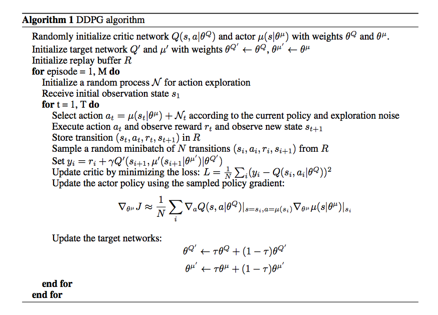
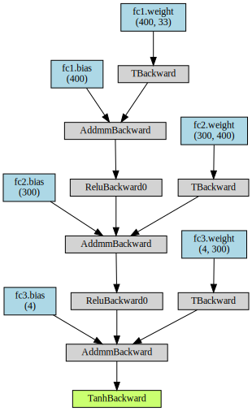
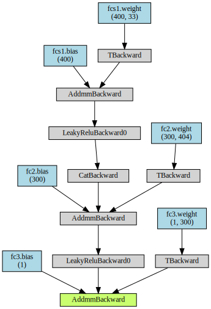
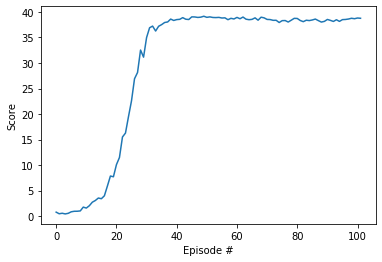

# Project 2: Continuous control

<!-- The report clearly describes the learning algorithm, along with the chosen hyperparameters. It also describes the model architectures for any neural networks. -->

## Learning Algorithm: Deep Deterministic Policy Gradient (DDPG)

DDPG is a model-free, off-policy algorithm taking inspiration from the DPG and Q-learning.

__Model-free__ means that the agent uses exclusively the information contained in the experiences it had.

__Off-policy__ means that the agents chooses the best next action, regardless on how the next action is chosen as long as it is the best. The advantage is it is policy efficient as we don't need to create new samples from the updated policy.

### Algorithm



### Neural networks architecture
Following the DDPG paper, the neural networks depicted below both consist of:
* 3 Linear layers
  * fc1: input size = state space size (33), output size = 400
  * fc2: input size = 400, output size = 300
  * fc3: input size = 300, output size = action space size (4)
* connected by a ReLU activation function for the Actor or leaky ReLU activation function for the Critic

The following visualizations were made with `NN-visualization.ipynb`.

#### Actor


#### Critic
Actions are included from the second hidden layer.


### Tricks

#### Replay buffer
Replay buffers are common amongst deep reinforcement learning algorithms which approximate the optimal $Q_*(s,a)$.

In order to have a stable learning, we need to have a large enough buffer but not too large so the learning might be too slow (due to irrelevant experiences).

#### Noise
* Add different noise to all agents
* Compared to the Udacity implementation which uses a uniform distribution to generate the OU noise, I used a standard normal distribution

#### Others
* Use 20 agents instead of 1 to generate more samples
* Change hyper-parameters (big batch size, etc.)

#### From Lilicrap (2016) paper
I used the following hyperparameters described in the DDPG paper:
* Hidden layers: `400` for actor and `300` for critic
* Learning rates: `1e^-4` for actor, `1e^-3` for critic (actually inverse of what is used in the paper)
* Minibatch: 64

What I didn't do:
* Batch normalization: some issues raised due to a pytorch / CUDA incompatibility


## Hyperparameters

```py
BUFFER_SIZE = int(1e6)  # replay buffer size
BATCH_SIZE = 64         # minibatch size
GAMMA = 0.99            # discount factor
TAU = 0.001             # for soft update of target parameters
LR_ACTOR = 0.001        # learning rate of the actor
LR_CRITIC = 0.0001      # learning rate of the critic
WEIGHT_DECAY = 0        # L2 weight decay
```
The agent learns for a maximum of `1000` timesteps per episode.

## Observation space
The observation space consists of 33 variables corresponding to position, rotation, velocity, and angular velocities of the arm. Each action is a vector with four numbers, corresponding to torque applicable to two joints. Every entry in the action vector should be a number between -1 and 1.

## Rewards
A reward of +1 is provided for collecting a yellow banana, and a reward of -1 is provided for collecting a blue banana.
A reward of +0.1 is provided for each step that the agent's hand is in the goal location.


### Solving condition
To solve this environment, the agent needs to receive an average reward (over 100 episodes) of at least +30.

### DDPG reward curve


The environment was solved in __102__ episodes.

## Ideas for Future Work

### Noise
* Use pure Gaussian noise instead of the OU noise
* OU noise decay
* Parameter noise instead of action noise ([Plappert et al. (2017)](https://arxiv.org/abs/1706.01905))

### Misc.
* Instead of updating 20 times (1 time per agent) every timestep, update 10 times every 20 timesteps
