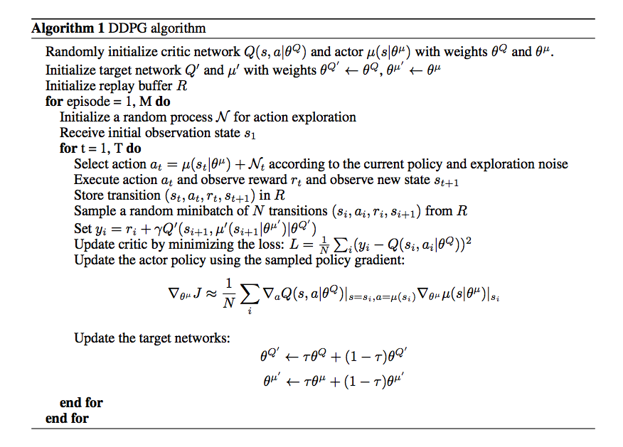
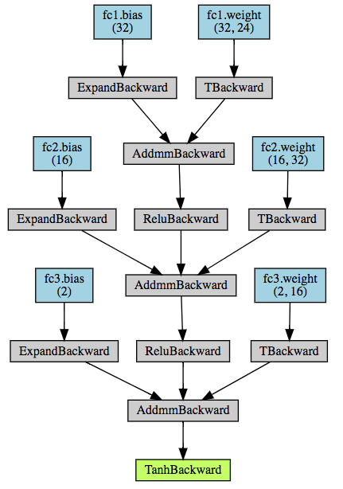
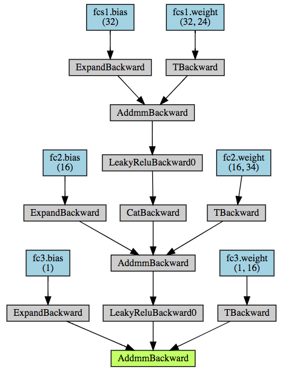
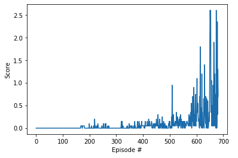

# Project 3: Collaboration and competition

<!-- The report clearly describes the learning algorithm, along with the chosen hyperparameters. It also describes the model architectures for any neural networks. -->

The project 3 is about collaboration and competition. The environment is a multi-agent one where two agents play a match of tennis.
The goal is to keep the ball in play as long as possible.

Even if the environment is multi-agent where a multi-agent algorithm version would perform better, I wanted to try as a baseline the Agent I used for the project 2.

TL;DR: Based on this agent performance, I didn't need to implement a multi-agent version :)

## Learning Algorithm: Deep Deterministic Policy Gradient (DDPG)

DDPG is a model-free, off-policy algorithm taking inspiration from the DPG and Q-learning.

__Model-free__ means that the agent uses exclusively the information contained in the experiences it had.

__Off-policy__ means that the agents chooses the best next action, regardless on how the next action is chosen as long as it is the best. The advantage is it is policy efficient as we don't need to create new samples from the updated policy.

### Algorithm



### Neural networks architecture
Following the DDPG paper, the neural network depicted below consists of:
* 3 Linear layers
  * fc1: input size = state space size (24), output size = 32
  * fc2: input size = 32, output size = 16
  * fc3: input size = 16, output size = action space size (2)
* connected by a ReLU activation function for the Actor or leaky ReLU activation function for the Critic

The following visualizations were made with `NN-visualization.ipynb`  

#### Actor


#### Critic
Actions are included from the second hidden layer.


### Tricks

#### Replay buffer
Replay buffers are common amongst deep reinforcement learning algorithms which approximate the optimal $Q_*(s,a)$.

In order to have a stable learning, we need to have a large enough buffer but not too large so the learning might be too slow (due to irrelevant experiences).

#### Noise
* Add different noise to all agents
* Compared to the Udacity implementation which uses a uniform distribution to generate the OU noise, I used a standard normal distribution


## Hyperparameters

```py
BUFFER_SIZE = int(1e5)  # replay buffer size
BATCH_SIZE = 512        # minibatch size
GAMMA = 0.95            # discount factor
TAU = 0.01              # for soft update of target parameters
LR_ACTOR = 0.001        # learning rate of the actor
LR_CRITIC = 0.001       # learning rate of the critic
WEIGHT_DECAY = 0        # L2 weight decay
```

## Observation space
The observation space consists of 8 variables corresponding to the position and velocity of the ball and racket. Each agent receives its own, local observation. Two continuous actions are available, corresponding to movement toward (or away from) the net, and jumping.


## Rewards
In this environment, two agents control rackets to bounce a ball over a net. If an agent hits the ball over the net, it receives a reward of +0.1. If an agent lets a ball hit the ground or hits the ball out of bounds, it receives a reward of -0.01. Thus, the goal of each agent is to keep the ball in play.


### Solving condition
To solve this environment, the agent needs to receive an average reward (over 100 episodes) of at least +0.5.

### DQN reward curve


The environment was solved in __682__ episodes.

## Ideas for Future Work

* Implement the Multi Agent version of DDPG

### Noise
* Use pure Gaussian noise instead of the OU noise
* OU noise decay
